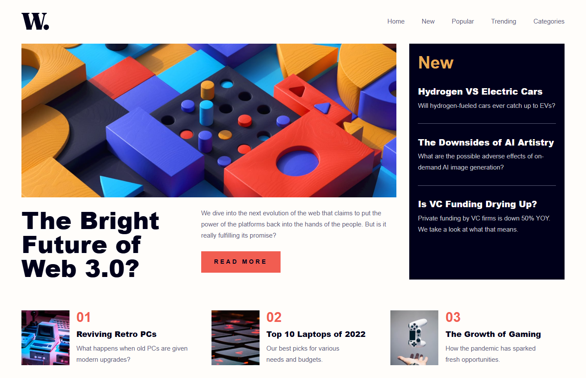

# Frontend Mentor - News homepage solution

This is a solution to the [News homepage challenge on Frontend Mentor](https://www.frontendmentor.io/challenges/news-homepage-H6SWTa1MFl). Frontend Mentor challenges help you improve your coding skills by building realistic projects.

## Table of contents

- [Overview](#overview)
  - [The challenge](#the-challenge)
  - [Screenshot](#screenshot)
  - [Links](#links)
- [My process](#my-process)
  - [Built with](#built-with)
  - [What I learned](#what-i-learned)
- [Author](#author)

## Overview

### The challenge

Users should be able to:

- View the optimal layout for the interface depending on their device's screen size
- See hover and focus states for all interactive elements on the page

### Screenshot



### Links

- Solution URL: [Frontend Mentor Solution](https://www.frontendmentor.io/solutions/news-homepage-1PMgd143LK)
- Live Site URL: [News Homepage](https://gustavo2023.github.io/news-homepage/)

## My process

### Built with

- Semantic HTML5 markup
- CSS custom properties
- Flexbox
- CSS Grid
- Mobile-first workflow
- Javascript

### What I learned

This project provided valuable practice in implementing a responsive design with a focus on accessibility and interactive elements.

**Accessibility:**

- Utilized semantic HTML elements (`<nav>`, `<main>`, `<article>`, `<section>`) to improve page structure and navigation for assistive technologies.
- Implemented ARIA attributes (`aria-label`, `aria-controls`, `aria-expanded`, `aria-hidden`) extensively, especially for the mobile navigation, to provide context and state information to screen reader users.
- Ensured all images have descriptive `alt` attributes.
- Used a `.visually-hidden` class to provide accessible labels for elements like section headings without displaying them visually.
- Added `:focus-visible` styles for clearer keyboard navigation focus indicators.

**Mobile Sidebar Implementation:**

- Created a mobile-first navigation sidebar using `position: fixed`, `transform: translateX()`, and `transition` for smooth slide-in/slide-out effects.
- Managed the sidebar's visibility and state using JavaScript by toggling CSS classes (`.open`, `.visible`) and updating ARIA attributes dynamically.
- Implemented an overlay element that appears with the sidebar, providing a visual cue and a way to close the sidebar by clicking outside of it.
- Added keyboard accessibility for the sidebar, allowing users to close it using the `Escape` key.
- Used media queries to conditionally display the mobile menu button and hide the desktop navigation on smaller screens, and vice-versa on larger screens.

```javascript
// Example: Toggling sidebar visibility and ARIA attributes
const openSidebar = () => {
  sidebar.classList.add("open");
  sidebar.setAttribute("aria-hidden", "false");
  openMenuBtn.setAttribute("aria-expanded", "true");
  // ... overlay logic ...
  closeMenuBtn.focus(); // Move focus to the close button
};

const closeSidebar = () => {
  sidebar.classList.remove("open");
  sidebar.setAttribute("aria-hidden", "true");
  openMenuBtn.setAttribute("aria-expanded", "false");
  // ... overlay logic ...
  openMenuBtn.focus(); // Return focus to the open button
};
```

```css
/* Example: Sidebar CSS for positioning and animation */
.mobile-sidebar {
  position: fixed;
  /* ... other styles ... */
  transform: translateX(100%);
  transition: transform 0.3s ease-in-out;
  visibility: hidden;
}

.mobile-sidebar.open {
  transform: translateX(0);
  visibility: visible;
}
```

## Author

- Frontend Mentor - [@gustavo2023](https://www.frontendmentor.io/profile/gustavo2023)
